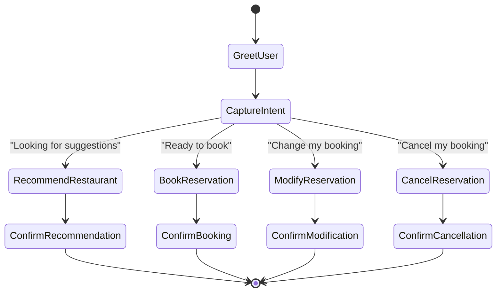

# Use Case for FoodieSpot Restaurant Reservation AI Agent

---

## Goal

### Long Term Goal
- Automate 90%+ of restaurant reservations without human staff involvement.
- Improve customer experience through instant, personalized, intelligent reservation handling.
- Expand the solution to other hospitality sectors like event booking, hotel reservations, salons.

### Success Criteria
- 90%+ of bookings successfully completed via bot without human intervention.
- Reservation processing time reduced by 25%.
- 15% increase in multi-party/group bookings.
- Customer Satisfaction Score (CSAT) > 8/10.
- Successful pilot rollout across 20 locations in 3 months.

---

## Use Case (in 100 words)

FoodieSpot wants to streamline its reservation management across multiple locations. The AI Reservation Agent will allow customers to book tables by simply chatting naturally. Customers can specify their preferences — location, cuisine, time, party size — and the agent will recommend the best-fit restaurant or book directly. It will handle modifications and cancellations too. The agent ensures real-time availability checking, upsells premium experiences (e.g., private seating), and reduces staff load. Designed with scalability in mind, it will eventually be adapted to other hospitality and service industries.

---

## Key Steps (Bot Flow)

1. Greet user and understand request (Booking / Recommendation / Modification / Cancellation).
2. Extract preferences: number of guests, time, cuisine, location preference.
3. Match with available restaurant slots.
4. Confirm booking with user.
5. Send booking details.
6. Handle modifications or cancellations if user requests.
7. Offer upsells (special arrangements if applicable).

---

## State Transition Diagram (Mermaid)

---

## Bot Features

- **Key Specifications**:
  - Natural conversation booking.
  - Real-time availability checking.
  - Personalized restaurant recommendations.
  - Modify and cancel reservations easily.

- **Knowledge Bases (KBs)**:
  - List of all restaurant locations, capacities, cuisines, available slots.

- **Does it Need Tools?**:
  - Yes:
    - `book_table()`
    - `recommend_restaurants()`
    - `modify_reservation()`
    - `cancel_reservation()`

- **Which Languages?**:
  - English (MVP).
  - (Optional: Scale to Hindi, Spanish later.)

- **New Features Asked For?**:
  - Personalized upselling (e.g., Birthday setups).
  - Dynamic recommendations based on seating load.

- **Difficulty Level (Color Code)**:
  - Green: Booking, Cancellation, Basic Recommendations.
  - Yellow: Handling modifications intelligently.
  - Red: Smart upselling, Multilingual support.

- **Integrations Needed**:
  - LLM API (like llama-3.1-8b).
  - (Optional future) SMS/Email service for confirmations.

---

## Scale up / Rollout Strategy

- **Pilot** in 5 restaurants first with 100 users.
- Monitor success rate, average booking time, feedback.
- Optimize conversation flows and handle common user misunderstandings.
- Full rollout to 20+ locations within 3 months.
- Post-success: Extend solution to external restaurant brands (SaaS offering).

---

## Key Challenges

- Accurate extraction of user preferences from natural conversation.
- Handling edge cases: last-minute full capacity, unclear user inputs.
- Maintaining low latency (fast LLM responses).
- Ensuring reliability during peak hours (load management).
- Building trust with users for self-serve bookings.

---

## Business Problems & Opportunities

### Current Problems Solved
1. **Operational Inefficiency**: Staff spend 30% of their time managing reservations.
2. **Booking Abandonment**: Customers hang up after waiting >2 minutes on phone calls.
3. **After-hours Booking Gap**: Missing potential customers when physical locations are closed.
4. **Recommendation Inconsistency**: Staff vary in their ability to match customer preferences with restaurants.

### Additional Opportunities
1. **Data-Driven Menu Planning**: Aggregate preference data to inform menu changes and specials.
2. **Dynamic Pricing Model**: Implement surge pricing during peak hours and discounts during off-peak times.
3. **Cross-Location Customer Journey**: Track customer preferences across multiple locations for personalized experiences.
4. **Operational Optimization**: Predict staffing needs based on reservation patterns.
5. **Marketing Automation**: Generate targeted promotions based on dining history and preferences.

---

## Return on Investment Projections

### Cost Savings
- Staff time reduction: $120,000 annually (across 20 locations)
- Error reduction: $50,000 annually (from double-bookings and miscommunications)

### Revenue Increase
- After-hours bookings: $200,000 annually (15% increase in total bookings)
- Improved capacity utilization: $300,000 annually (filling previously empty tables)
- Upselling through recommendations: $150,000 annually

### Implementation Costs
- Development and deployment: $150,000
- Ongoing maintenance and API costs: $60,000 annually

### Net ROI
- Year 1: 53% ROI
- Year 2: 173% ROI
- 3-year cumulative return: $1.1 million

---

## Vertical Expansion Potential

### Short-term (6-12 months)
1. **Catering Services**: Extend system to handle group and event catering bookings.
2. **Loyalty Program Integration**: Connect reservations to customer loyalty points and rewards.
3. **Menu Pre-ordering**: Allow customers to pre-select menu items during reservation.

### Medium-term (12-24 months)
1. **Hotel Restaurant Integration**: Partner with hotels to offer in-house dining reservations.
2. **Delivery/Pickup Integration**: Connect reservation system with takeout options.
3. **Event Planning**: Expand to full-service event booking and management.

### Long-term (2+ years)
1. **White-label SaaS Product**: Offer the system to other restaurant chains as a service.
2. **Cross-industry Expansion**: Adapt the core technology for:
   - Salon/spa appointments
   - Medical office scheduling
   - Professional service bookings (legal, consulting)
   - Entertainment venue ticketing

---

## Competitive Advantages

1. **Hybrid Approach**: Combines the convenience of online booking with personalized conversational experience.
2. **Multi-location Intelligence**: Unlike single-restaurant solutions, can balance load across multiple locations.
3. **Preference Learning**: Builds customer profiles over time to improve recommendations with each interaction.
4. **Operational Integration**: Directly connects with restaurant operations rather than just being a booking interface.
5. **Flexible Deployment**: Works across multiple channels (web, mobile, social media, voice) with consistent experience.

---

## Key Stakeholders

1. **Restaurant Management Team**: Primary decision-makers who need ROI data and operational improvements.
2. **Front-of-house Staff**: Users who will interact with and rely on the system.
3. **IT Department**: Responsible for integration and maintenance.
4. **Marketing Team**: Will leverage data insights and promote the new booking experience.
5. **Customers**: End users whose satisfaction is the ultimate success measure.

---

## Implementation Timeline

### Phase 1: Development (Weeks 1-6)
- Week 1-2: Requirements finalization and system design
- Week 3-4: Core functionality development
- Week 5-6: Integration and testing

### Phase 2: Pilot (Weeks 7-10)
- Week 7: Deployment to 5 test locations
- Week 8-9: Data collection and system refinement
- Week 10: Pilot evaluation and go/no-go decision for expansion

### Phase 3: Full Rollout (Weeks 11-16)
- Week 11-12: Staff training program
- Week 13-14: Staged rollout to remaining locations
- Week 15-16: Post-deployment optimization

### Phase 4: Enhancement (Weeks 17+)
- Add advanced features based on initial usage data
- Begin planning for first vertical expansion